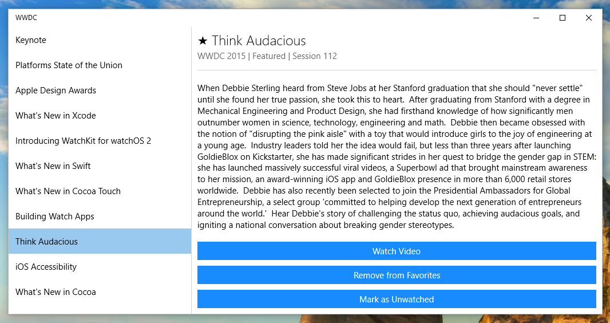
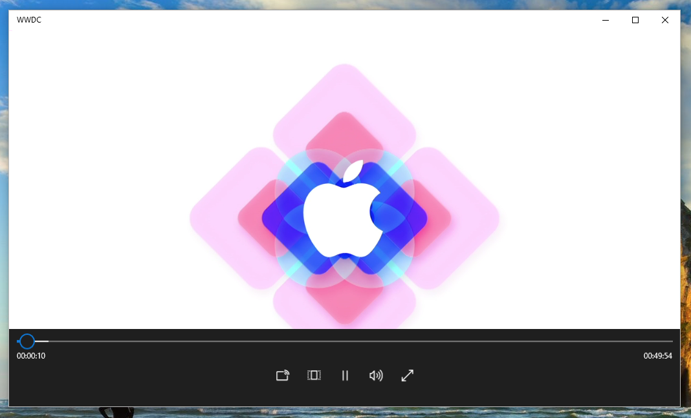

# WWDC app for Windows 10

Use this app to watch WWDC sessions on your PC or Windows Tablet.

From the same creator of [the unofficial WWDC app for macOS](https://github.com/insidegui/WWDC).

## OS Support

I only tested the app on Windows 10 build 10586, It should work with any Windows 10 build 10240 or later.

### Disclaimer

This is a "toy project", I am not a Windows developer and I've made this app just to see how It's like to create a modern Windows app.